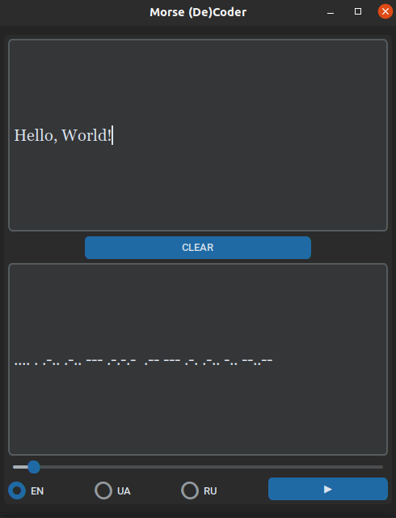

<h1 style="text-align:center">Morse Encryptor and Decryptor</h1> 

  

---

Welcome to the Morse Encryptor and Decryptor tool! This tool allows you to encode and decode text using the Morse code, a well-known method of representing characters with dots and dashes. Whether you're communicating secretly or just having fun with coding, our tool has got you covered.

## Features

- Encode regular text into Morse code
- Decode Morse code back to readable text
- Support for English, Ukrainian, and Russian languages
- Easy-to-use interface

## How to Use

1. Choose your desired language (English, Ukrainian, or Russian).
2. Enter your text in the input field.
3. The tool will automatically encrypt or decrypt your text in real-time.
4. To change the input field, right-click on the desired input.
5. Enjoy the magic of Morse code communication!

## Installation

1. Clone this repository to your local machine. Python 3.10 or above must be installed
2. If not installed you need to execute `sudo apt-get install python3-dev`
3. Also, if not installed you need to execute `sudo apt-get install python3-tk`
4. Install the required libraries using `pip install -r requirements.txt`.
5. Run the application using `python3 main.py`.

## Creation of a binary or *.exe file using PyInstaller

1. Run a command `pyinstaller --noconfirm --onefile --windowed --add-data "morse_encryptor/sounds/*.bin:morse_encryptor/sounds" --name "Morse De(Coder)" main.py`
2. If command still not working try `sudo apt-get install python<specific-version>-dev`
3. If command still not working try `sudo apt-get install python<specific-version>-tk`
4. To create *.exe file on Windows run a command `pyinstaller --noconfirm --onefile --windowed --add-data "morse_encryptor/sounds/*.bin:morse_encryptor/sounds" --name "Morse De(Coder)" --icon=images/morse_icon.ico main.py`

## Compatibility

This tool works seamlessly with English, Ukrainian, and Russian languages. Simply select your preferred language and start encoding or decoding messages.